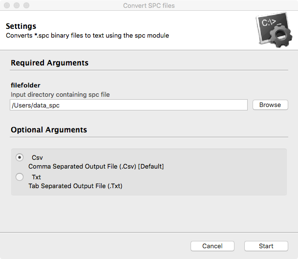

# spc

[](https://travis-ci.org/rohanisaac/spc)

A module for working with .SPC files in Python. SPC is a binary data format to store a variety of spectral data, developed by Galactic Industries Corporation in the '90s. Popularly used Thermo Fisher/Scientific software GRAMS/AI. Also used by others including Ocean Optics, Jobin Yvon Horiba. Can store a variety of spectrum including FT-IR, UV-VIS, X-ray Diffraction, Mass Spectroscopy, NMR, Raman and Fluorescence spectra.

The SPC file format can store either single or multiple y-values, and the x-values can either be given explicitly or even spaced x-values can be generated based on initial and final points as well as number of points. In addition the format can store various log data and parameters, as well as various information such as axis labels and scan type.

## Features

1. Extracts header information into object members
2. For each subfile, extract subfile data into `subFile` class objects `sub[0]` (, `sub[1]`, `sub[2]`, ...)
3. Extract x and y values into numpy `ndarray`
4. Attempts to interpret x,y, and z labels, as well as scan type
5. Member functions to output data in text, or plot using `matplotlib`

## Installation

### Requirements

```
python2.7+
numpy
matplotlib (optional, for plotting)
```

Download zip and extract or clone repository. From the resulting folder run

```bash
$ cd ~/Downloads/spc-master/
$ python setup.py install
```

## Usage

From a Python/IPython session or in a script

```python
>>> import spc
>>> f = spc.File('/Desktop/sample.spc')  # read file
x-y(20)  # format string
>>> f.data_txt()  # output data
>>> f.write_file('output.txt')  # write data to file
>>> f.plot()  # plot data
```

Note the format string outputed refers to where data is stored the object, which corresponds to the various ways data can be stored in the spc file format. Items before the `-` means that data is global, after the `-` means the data is in a subFile, and the (n) refers to the number of subfiles.

### Examples

Format string | Meaning
------------- | --------------------------------------------------------------------
x-y(3)        | one global x-data series, 3 corresponding y-data series
-xy(4)        | four subfiles with individual x and y data series
gx-y(10)      | single global x-data (generated), and 10 corresponding y-data series

### Accessing data

The object generated is populated with all the data and metadata from the file. The data can be manully accessed using the entry in the table corresponding to the format string outputted.

format string | x-values                  | y-values
------------- | ------------------------- | -------------------------
-xy(n)        | f.sub[0].x ... f.sub[n].x | f.sub[0].y ... f.sub[n].y
x-y(n)        | f.x                       | f.sub[0].y ... f.sub[n].y
gx-y(n)       | f.x (generated)           | f.sub[0].y ... f.sub[n].y

Depending on the information stored in the file, there are a number of metadata fields that may be populated. Some commonly used fields are

metadata            | variable
------------------- | -----------
x-label             | f.xlabel
y-label             | f.ylabel
z-label             | f.zlabel
Comment (formatted) | f.cmnt
Comment (raw)       | f.fcmnt
Experiment type     | f.exp_type
Log dictionary      | f.log_dict
Log (remaining)     | f.log_other

To get a full list of data/metadata stored in the object, you can run `object.__dict__` on the file and subFile objects.

### Functions

Functions      | Description
-------------- | -------------------------------------
f.data_txt()   | Outputs data to stdout
f.debug_info() | Human readable metadata for debugging
f.plot()       | Plots data using matplotlib
f.write_file() | Writes data to text file

### File versions supported

File versions are given by the second bit in the file, `fversn` in an SPC object. Currently the library supports the following `fversn` bytes.

fversn | Description      | Support      | Notes
------ | ---------------- | ------------ | ----------------------------------------------------------------
0x4B   | New format (LSB) | Good         | z-values are not accounted for in data_txt() and plot() commands
0x4C   | New format (MSB) | None         | need sample file to test
0x4D   | Old format       | Good         |
0xCF   | SHIMADZU format  | Very limited | no metadata support, only tested on one file, no specifications

## File converter

The file converter can be use to convert files/directories from the terminal.

### CLI: convert.py

```
$ python convert.py --help
usage: convert.py [-h] [-c | -t] filefolder [filefolder ...]

Converts *.spc binary files to text using the spc module

positional arguments:
  filefolder  Input *.spc files or directory

optional arguments:
  -h, --help  show this help message and exit
  -c, --csv   Comma separated output file (.csv) [default]
  -t, --txt   Tab separated output file (.txt)
```

#### Examples

```
Convert file1.spc and file2.spc to file1.txt and file2.txt (tab delimited)
$ python convert.py file1.spc file2.spc -t
Convert the spc files in spc_dir to .csv files
$ python convert.py spc_dir
```

### GUI: convert_gui.py

Uses Tk which is generally included as part of Python standard library.

#### Notes

1. Only works with Python 2.7 right now, need to fix imports for Python 3.x
2. Only works on a single folder at a time.
3. Tkinter sometimes needs to be installed on linux distributions



### Notes

- Used format specification from SDK [1]
- Loads entire file into memory
- Data uses variable naming as in SPC.H

### Todo

- ~~Use flag for 16bit and test~~
- Check struct string (`<` vs others, using signed vs. unsigned ints)
- Remove repetitions in sub class
- Remove multiple definitions of flag bits
- Better debug info that works all the time
- Year info for old data
- ~~Fix exponent in 16 bit format~~
- Add labels to ~~plots and~~ text output
- Merge both subFile classes, they are pretty similar

## References

[1] "Thermo Scientific SPC File Format." Thermo Fisher Scientific, Web. 20 July 2014\. <http://ftirsearch.com/features/converters/SPCFileFormat.htm>.
